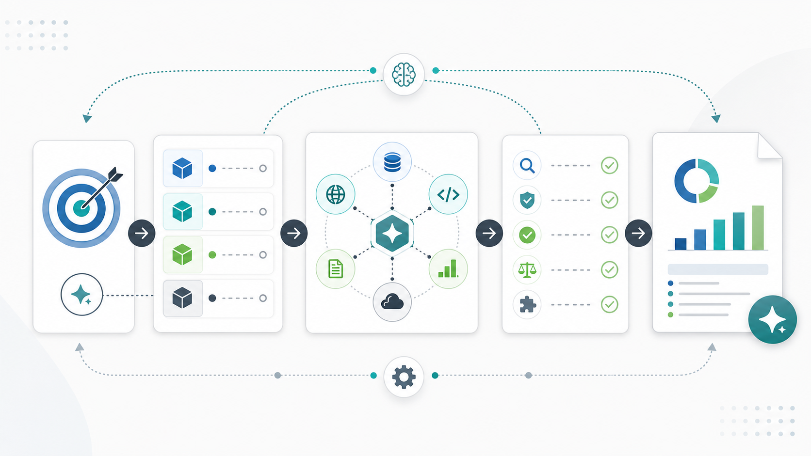
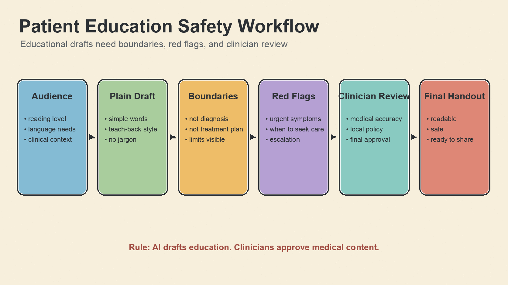

# Codex Dynamic Workflows Enhanced

A practical, beginner-friendly dynamic workflow skill for Codex-style AI agents.



This project keeps the workflow general-purpose: it can help with software engineering, research, writing, audits, product planning, medical education workflows, patient-facing content drafts, and other complex tasks that benefit from explicit planning, work packets, review gates, and verification.

It is not a medical-only workflow. Medical examples are included because doctors, patients, and healthcare beginners often need extra clarity, safety boundaries, and step-by-step guidance.

## Who This Is For

- Developers who need a safer way to run multi-step coding, refactoring, testing, or release tasks.
- Researchers and writers who need evidence review, drafting, checking, and final synthesis to stay separate.
- Doctors and clinical educators who want AI help with literature review, teaching material, patient education drafts, or medical AI project documentation.
- Beginners who need the agent to show the path instead of hiding every action inside one vague answer.
- Project owners preparing a GitHub repository, README, examples, assets, and publishing checklist.

## What This Workflow Is

Dynamic workflows turn one broad task into a supervised execution plan:

```text
Goal -> Success criteria -> Work packets -> Integration -> Verification -> Final report
```

Instead of asking an AI agent to "just do everything", this workflow makes the agent:

- define what done means
- split independent work into clear packets
- ask for approval before risky steps
- keep research, implementation, review, and verification separate
- integrate results instead of dumping raw notes
- report what was checked and what remains uncertain

## When To Use It

Use this workflow when a task has at least two of these traits:

- it has multiple parts, such as research plus writing plus review
- the result needs to be checked carefully
- there are safety, privacy, data, publication, or production risks
- several people or agents could work on different parts
- the task may become a reusable process
- the user is a beginner and needs a visible step-by-step path

Do not use the full workflow for tiny tasks. If the task is small, answer directly.

## What It Looks Like In Practice

Use it when the task sounds like this:

- "Help me turn this messy idea into a publishable GitHub project."
- "Audit this repository and give me a safe implementation plan."
- "Plan a literature review, evidence table, and teaching outline for clinicians."
- "Draft patient-facing education content, but make sure it stays educational and needs clinician review."
- "Help a beginner publish a local project without accidentally leaking secrets or confusing local changes with a pushed repository."
- "Split this large task into research, implementation, documentation, review, and verification."

The workflow usually produces:

- a short goal and success criteria
- clear work packets
- approval gates for risky actions
- an integration summary
- verification evidence
- a final report with remaining risks

## Example Scenarios

### Software Engineering

```text
Use $codex-dynamic-workflows-enhanced to plan and implement a safe refactor of the authentication module, with tests and a final verification pass.
```

Typical packets:

- codebase discovery
- implementation
- test update
- security review
- final verification

### Doctor Research Workflow


```text
Use $codex-dynamic-workflows-enhanced to plan a literature review workflow for a physician preparing a teaching session on perioperative anemia.
```

Typical packets:

- define clinical question and audience
- search strategy
- evidence table
- draft teaching outline
- citation and safety review

### Patient-Facing Content Draft



```text
Use $codex-dynamic-workflows-enhanced to create a safe workflow for drafting patient education material about sleep apnea screening.
```

Typical packets:

- define audience and reading level
- draft plain-language content
- identify red flags and escalation language
- clinician review checklist
- final readability pass

### Beginner Learning Workflow


```text
Use $codex-dynamic-workflows-enhanced to help a beginner learn how to publish a small GitHub project safely.
```

Typical packets:

- explain the goal in plain language
- inspect the local project
- prepare README and examples
- verify no secrets are included
- explain commit, push, and publish steps before doing them

## Real-World Uses

This workflow has already been useful for:

- Turning an existing generic agent workflow idea into a clearer public GitHub project.
- Separating "local draft", "committed", "pushed", and "published" states during repository release work.
- Adding README visuals, examples, install instructions, and safety boundaries before publishing.
- Structuring GitHub contribution work into candidate discovery, fit assessment, local patching, verification, and PR status tracking.
- Explaining doctor-facing and patient-facing examples without turning the whole workflow into a medical-only skill.

See [real-world-use-cases.md](examples/real-world-use-cases.md) for concrete examples.

## Install

Copy this folder into your local Codex skills directory:

```bash
mkdir -p "$HOME/.codex/skills"
cp -R codex-dynamic-workflows-enhanced "$HOME/.codex/skills/"
```

Then start a new Codex session or reload skills if your environment supports skill reload.

## Quick Start

Ask:

```text
Use $codex-dynamic-workflows-enhanced to plan this task before executing: [your task]
```

For a reusable local artifact:

```bash
python3 "$HOME/.codex/skills/codex-dynamic-workflows-enhanced/scripts/new_workflow.py" \
  "My complex task"
```

This creates:

```text
.workflow/<slug>/
|-- plan.md
|-- state.json
|-- orchestration.md
|-- packets/
|-- results/
`-- final-report.md
```

## Recommended Project Structure

```text
codex-dynamic-workflows-enhanced/
|-- SKILL.md
|-- README.md
|-- LICENSE
|-- assets/
|   |-- beginner-github-workflow.png
|   |-- doctor-literature-review.png
|   |-- patient-education-workflow.png
|   `-- workflow-overview.png
|-- agents/
|   `-- openai.yaml
|-- examples/
|   |-- beginner-github-project.md
|   |-- doctor-literature-review.md
|   |-- patient-education-draft.md
|   `-- real-world-use-cases.md
|-- references/
|   |-- approval-gates.md
|   |-- packet-patterns.md
|   |-- scenario-guides.md
|   `-- verification.md
`-- scripts/
    `-- new_workflow.py
```

## Safety Principles

- Ask before destructive file operations, commits, pushes, deployments, publishing, external submissions, or production changes.
- Do not upload private data, credentials, patient information, or sensitive files to third-party systems without explicit approval.
- Keep facts, assumptions, and recommendations separate.
- Verify with checks matched to the task risk.
- Report skipped checks honestly.

## License

MIT License. See [LICENSE](LICENSE).
