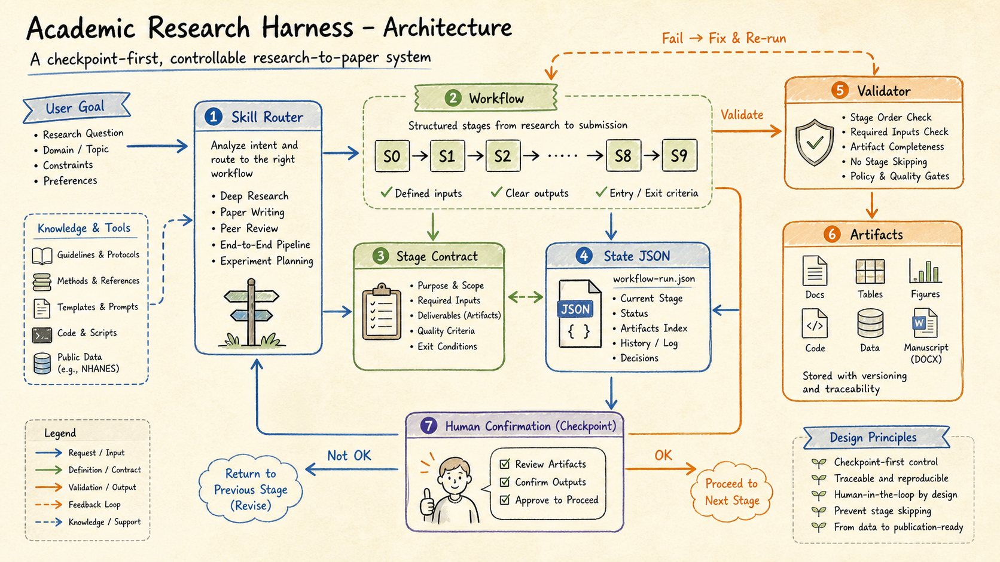

# Codex Dynamic Workflows Enhanced

A beginner-friendly dynamic workflow skill for Codex-style AI agents.

It helps an AI agent turn a broad, risky, or confusing task into visible work packets, approval gates, verification checks, and a final report.


## What This Project Is

`codex-dynamic-workflows-enhanced` is a reusable workflow skill for tasks that should not be handled as one giant AI answer.

Instead of asking an agent to "just do everything", the workflow makes the agent:

```text
Goal -> Success Criteria -> Work Packets -> Approval Gates -> Verification -> Final Report
```

This makes the work easier to inspect, safer to approve, and easier to repeat.

## Why Doctors And Beginners Need It

Doctors, clinical educators, patients, and beginners often face the same problem from different angles: the AI answer may look fluent, but the process behind it is hidden.

- A doctor needs evidence boundaries, citation checks, and clinician judgment.
- A patient education writer needs plain language, red flags, and review gates.
- A beginner needs to see which step is local, committed, pushed, or publicly published.
- A developer needs a reproducible structure that can be automated.

The workflow keeps those needs explicit instead of hiding them inside one polished response.

## How It Works


A dynamic workflow has three repeating units:

- **Work packet**: a small task with clear inputs and outputs.
- **Approval gate**: a place where the user must confirm before the agent performs risky work.
- **Verification**: checks matched to the task risk, such as tests, source checks, link checks, or safety review.

The result is a final report that says what was done, what was checked, and what still needs human judgment.

## Visual Examples

### Workflow Architecture



Use this when explaining the project to developers, workflow designers, or advanced learners. It shows the relationship between the skill router, workflow stages, stage contracts, state files, validators, artifacts, and human confirmation.

The key teaching point is simple: an AI workflow is not only a prompt. It needs state, gates, validation, and visible artifacts.

Example prompt:

```text
Use $codex-dynamic-workflows-enhanced to design a checkpoint-first workflow with state files, artifacts, and validation checks.
```

### Doctor Literature Review


Use this when a physician or educator wants help preparing a teaching session, review outline, or evidence table. The workflow separates the clinical question, search strategy, evidence table, teaching outline, citation check, and clinician review.

This is educational support. It is not a guideline replacement and not a substitute for professional clinical judgment.

Example prompt:

```text
Use $codex-dynamic-workflows-enhanced to plan a literature review workflow for a physician preparing a teaching session on perioperative anemia.
```

### Patient-Facing Education Draft


Use this when drafting plain-language patient education material. The workflow keeps audience level, safety boundaries, red flags, escalation language, readability, and clinician review separate.

The output should never be framed as individualized diagnosis or treatment advice.

Example prompt:

```text
Use $codex-dynamic-workflows-enhanced to create a safe workflow for drafting patient education material about sleep apnea screening.
```

### Beginner GitHub Publishing


Use this when a beginner wants to publish a project but needs to understand the difference between local files, staged files, a commit, a pushed branch, and a public repository.

The workflow requires approval before commit, push, repository creation, publishing, or any externally visible action.

Example prompt:

```text
Use $codex-dynamic-workflows-enhanced to help a beginner prepare a local project for GitHub release.
```

## Who Should Use It

- Developers running multi-step refactors, audits, testing, or releases.
- Doctors and clinical educators preparing literature review, teaching, or medical AI documentation.
- Patient education teams drafting plain-language material that still needs clinician review.
- Beginners publishing projects to GitHub for the first time.
- Project owners converting a messy idea into a reusable workflow.

## When To Use It

Use this workflow when a task has at least two of these traits:

- multiple parts, such as research plus writing plus review
- safety, privacy, publication, medical, or production risk
- several possible work packets
- a need for human approval before risky actions
- a need for verification evidence
- a goal that should become reusable

Skip the full workflow for tiny tasks. If the task is small, answer directly.

## Install

Copy this folder into your local Codex skills directory:

```bash
mkdir -p "$HOME/.codex/skills"
cp -R codex-dynamic-workflows-enhanced "$HOME/.codex/skills/"
```

Then start a new Codex session or reload skills if your environment supports skill reload.

## Quick Start

Ask Codex:

```text
Use $codex-dynamic-workflows-enhanced to plan this task before executing: [your task]
```

For a reusable local artifact:

```bash
python3 "$HOME/.codex/skills/codex-dynamic-workflows-enhanced/scripts/new_workflow.py" \
  "My complex task"
```

This creates:

```text
.workflow/<slug>/
|-- plan.md
|-- state.json
|-- orchestration.md
|-- packets/
|-- results/
`-- final-report.md
```

## Teaching Path

This repository can also be used as a short teaching module:

1. Start with the overview image.
2. Explain work packets, gates, and verification.
3. Walk through the doctor literature review example.
4. Walk through the patient education example.
5. Walk through the beginner GitHub publishing example.
6. Ask learners to adapt one example to their own task.

See [docs/03-teaching-script.md](docs/03-teaching-script.md).

## Recommended Project Structure

```text
codex-dynamic-workflows-enhanced/
|-- SKILL.md
|-- README.md
|-- LICENSE
|-- assets/
|-- docs/
|-- examples/
|-- references/
`-- scripts/
```

## Safety Boundaries

- Ask before destructive file operations, commits, pushes, deployments, publishing, external submissions, or production changes.
- Do not upload private data, credentials, patient information, or sensitive files to third-party systems without explicit approval.
- Keep facts, assumptions, and recommendations separate.
- Verify with checks matched to the task risk.
- Medical outputs are drafts or workflow artifacts and must be reviewed by qualified clinicians before use.
- Report skipped checks honestly.

## More Documentation

- [For doctors](docs/01-for-doctors.md)
- [For beginners](docs/02-for-beginners.md)
- [Teaching script](docs/03-teaching-script.md)
- [Replicate a workflow](docs/04-replicate-a-workflow.md)
- [Image guide](docs/05-image-guide.md)
- [Real-world use cases](examples/real-world-use-cases.md)

## License

MIT License. See [LICENSE](LICENSE).
